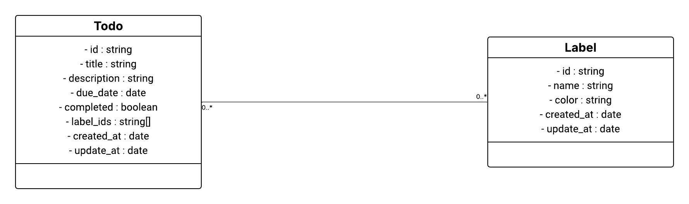

# 📘 Documentation — `@todo/entity`

## 🧭 Introduction

Ce document présente la **spécification formelle** du module `@todo/entity`, une bibliothèque TypeScript exposant les **entités** et **contrats métier fondamentaux** du domaine TODO.

Ce module constitue une **couche entity** stable, agnostique, purement déclarative, indépendante de toute technologie ou environnement d’exécution. Il est conçu pour être **interopérable** et **extensible** dans des architectures modulaires.

---

## 🗂️ Structure du projet

```txt
src/
├── critical-business-rules/       # Règles métier critiques (use cases agnostiques)
│   ├── add-label-to-todo.ts
│   ├── check-or-uncheck-todo.usecase.ts
│   ├── create-label.usecase.ts
│   ├── create-todo.usecase.ts
│   └── index.ts
│
├── entities/                      # Définition des entités métier (classes)
│   ├── index.ts
│   ├── label.entity.ts
│   └── todo.entity.ts
│
└── index.ts                       # Point d'entrée du module `@todo/entity`
```

---

## 🧱 Principes de conception

- **Pur métier** : aucune dépendance aux systèmes externes (base de données, API, navigateur…)
- **Stable** : le code évolue rarement, avec une forte valeur documentaire
- **Interopérable** : facilement injectable dans différents contextes d’architecture (modulaire, hexagonale…)
- **Testable** : toute implémentation métier peut être simulée via les contrats d’interface

---

## 📊 Diagramme de classes

> 📝 *Le diagramme de classes permet de visualiser les relations entre `Todo`, `Label`, et les interfaces du dossier `critical-business-rules/`.*



---

## 👥 Contribution

Les développeurs sont encouragés à :

- Proposer des améliorations aux entités existantes
- Ajouter de nouvelles entités ou interfaces métier pertinentes
- Écrire des spécifications ou documents de conception complémentaires
- Créer des implémentations concrètes de ces contrats dans des modules externes

> Merci de respecter la séparation stricte entre la **définition métier** et son **implémentation technique**.

---

## 🧪 Exemples d'utilisation

```ts
import { Todo, Label } from '@todo/entity';

const urgent = new Label("Urgent", "#FF0000");
const task = new Todo("Faire les courses", "Acheter du lait et du pain");

task.addLabel(urgent);
task.markAsDone();

console.log(task.done); // true
```

---

## 📌 À retenir

- Ce module constitue le **noyau métier** d’une application TODO.
- Il est **technologiquement neutre** : aucun lien avec une base de données, un framework ou une plateforme.
- Il repose uniquement sur du **TypeScript déclaratif** (classes, interfaces, types).
- Toute modification doit être :
  - ✍️ Documentée dans `DOC.md`
  - 🧪 Compatible rétroactivement autant que possible
  - 🤝 Discutée si elle impacte plusieurs modules

---

## 📄 Licence

Ce projet est distribué sous la licence **GNU**.

Vous êtes libres de :

- ✅ Utiliser ce module dans vos projets (personnels ou professionnels)
- ✅ Le modifier selon vos besoins
- ✅ Le redistribuer, en respectant la licence

Consultez le fichier [`LICENSE`](../LICENSE) pour plus d’informations.

---
